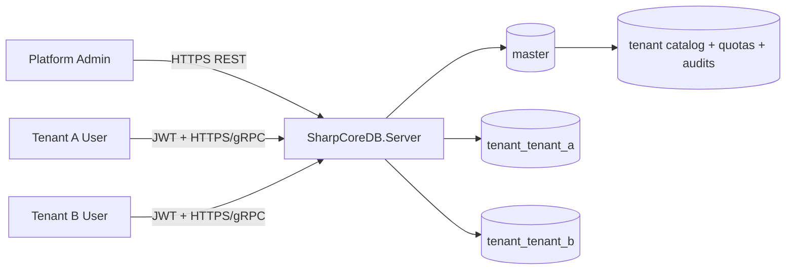

# SharpCoreDB Multi-Tenant SaaS Reference Sample v1.7.1

This reference sample demonstrates a database-per-tenant SaaS deployment with runtime tenant provisioning, scoped JWT access, tenant quotas, tenant encryption keys, and security audit inspection.

## Goals
- onboard a tenant with the tenant management API
- connect with tenant-scoped users
- validate same-tenant access succeeds
- validate cross-tenant access is denied
- inspect tenant audit/security traces

## Sample Layout
- `appsettings.multitenant.sample.json` - reference server configuration
- `validate-tenant-isolation.ps1` - PowerShell validation script
- `tenant-onboarding.http` - manual REST flow for provisioning and validation

## Recommended Topology

## Quick Start
1. Copy `appsettings.multitenant.sample.json` into your server deployment as a starting point.
2. Start `SharpCoreDB.Server` with TLS enabled.
3. Run `pwsh ./validate-tenant-isolation.ps1 -BaseUrl https://localhost:8443`.
4. Review the output and the audit endpoints.

## Expected Validation Outcomes
- admin login succeeds
- tenant provisioning succeeds
- tenant A can query `tenant_tenant_a`
- tenant A is denied against `tenant_tenant_b`
- security audit endpoints show login/connect/denied events

## Notes
- The sample uses REST for readability. The same tenant model applies to gRPC and WebSocket/Binary paths.
- Replace example secrets and certificate paths before any non-local use.
- Keep database-per-tenant as the default recommendation. Shared-database mode remains optional.

