# SharpCoreDB 2.0.0.0 — What's Changed from the 1.9 Line

**Version 2.0.0.0 is the performance-first, storage-architecture-complete release.** This document
summarizes everything that changed between the v1.9 line and the v2.0 line, with the benchmark
results that show exactly how much faster SharpCoreDB is now — and where it still trails SQLite.

> **Lines:** v1.9 = `release/v1.9` (tag `V1.9.9`) · v2.0 = `master` (this release, tag `2.0.0.0`) ·
> v2.1 = `release/v2.1.0.0` (.NET 11 future line)

---

## 1. What changed (feature overview)

| Area | v1.9 | v2.0 |
|---|---|---|
| **Single-file storage format** | Format v1 — fixed-offset metadata regions | **Format v2** — dynamic/growable Block Registry, Free Space Map and Table Directory; databases > 512 MB without reconfiguration |
| **Opening a v1.9 `.scdb` file** | — | **Automatic crash-safe v1 → v2 migration on open**, original preserved as `<file>.backup` |
| **Point reads (SQL)** | ~7.7K ops/s (hot-path debug I/O, no plan reuse) | **~59K ops/s (~7.7× faster)**: prepared/compiled plan reuse, regex-free normalization, shared parser, StructRow fast path |
| **StructRow zero-alloc read path** | did not exist | **New first-class API** (`ExecuteQueryStruct`), 83–94K ops/s |
| **UPDATE engine** | row-copy based | **In-place field patches** for fixed-width/columnar records (#6) — no more append-per-update growth |
| **Block-level compression** | v1.9.8 introduced Brotli/GZip blocks | **Brotli / GZip / Zstd** with configurable presets (`BlockCompressionLevel`, `MetadataCompressionLevel`, `CompressionThreshold`) + v1.9.8 read-path bug fixes |
| **Encryption** | block data at rest (#341) | **Envelope encryption** (`EncryptionPassword`, per-file DEK, PBKDF2-HMAC-SHA256) + **full at-rest metadata encryption** (`EncryptionMode = 2`) + key/password rotation |
| **Metadata sizing** | hard-coded 4-page regions | **Configurable** (`FsmSizePages`, `BlockRegistrySizePages`, `TableDirectorySizePages`) |
| **Publishing API** | 3-part versions (`1.9.9`) | **4-part versions** (`n.n.n.n`); assembly/file version `2.0.0.0` |
| **Framework** | .NET 10 | .NET 10 (v2.0) — the .NET 11 toolchain arrives in v2.1 |

**Headline:** the benchmark gap that made v1.x **16–52× slower than SQLite** on point
reads/updates/deletes is closed. SQL point reads went from **~7.7K → ~59K ops/s**, the Direct API
read path now **beats SQLite**, and SharpCoreDB beats **LiteDB on every single operation**.

## 2. Benchmark results — SharpCoreDB vs SQLite vs LiteDB

**Sources:** `docs/manual/performance.md` (v2.0.0 numbers), `docs/benchmarks/V198_V20_V21_PERFORMANCE_COMPARISON.md`
(v1.9.8 vs v2.0 vs v2.1), `docs/performance/V2_PERFORMANCE_PLAN.md` (v1.9 March baseline). The repository's own
comparative CRUD benchmark (`tests/benchmarks/SharpCoreDB.Benchmarks.Comparative`), 100K inserts + 10K point
reads/updates/deletes, AppendOnly engine, .NET 10. Runs on one Windows x64 box — treat ±20% as noise.

### 2.1 The full picture (ops/sec, representative values)

| Operation | v1.9.8 (net10) | **v2.0 — AppendOnly** | **v2.0 — PageBased** | SQLite | LiteDB |
|---|---:|---:|---:|---:|---:|
| **READ — SQL** | 7.7K | 59–64K | 30K | 89–99K | 13–16K |
| **READ — Direct API** | ~122K | **114–126K** | 34K | 89–99K | 13–16K |
| **READ — StructRow** (new in v2.0) | — | 83–94K | 36K | 89–99K | 13–16K |
| **INSERT — batch (Direct/StructRow)** | 130–138K | 100–134K | **194–206K** | 109–145K | 70–75K |
| **UPDATE — SQL / Direct** | 38–60K | 42–50K | 58–65K | 240–280K | 9–11K |
| **DELETE — SQL / Direct** | 37–133K | 29–128K | 107–129K | 318–376K | 13–14K |

### 2.2 How much did we win from v1.9 → v2.0?

| Metric | v1.9 | v2.0 | Win |
|---|---|---|---|
| **SQL point reads** | 7.67K ops/s | ~59K ops/s | **≈ 7.7× faster** |
| SQL read gap vs SQLite | **~11.6× slower** | **~1.4× slower** | gap closed ~8× |
| Direct-API read vs SQLite | ~1.2× faster | ~1.2–1.3× faster | **beats SQLite** |
| Read vs LiteDB | ~9× faster | ~5–8× faster | still dominating |
| INSERT batch vs SQLite | ~1.7× slower | PageBased **~1.5–1.9× faster** | **flips to win** |
| Every CRUD op vs LiteDB | faster | **faster on all four** | unchanged |

> The original **v1.9.0 March baseline** was ~16× slower (read), ~30× slower (update) and ~52× slower
> (delete) than SQLite. By v2.0.0.0 the read gap is ~1.4× and the Direct-API read path **beats SQLite**.
> UPDATE/DELETE still trail SQLite ~4–7× — that is structural (row-copy vs fixed-length C records) and
> is the targeted v2.1 in-place-record engine work.

### 2.3 Graph (ops/sec — higher is better)

```mermaid
xychart-beta
    title "SharpCoreDB 2.0.0.0 vs SQLite vs LiteDB — ops/sec (AppendOnly)"
    x-axis ["SQL Read", "Direct Read", "StructRow Read", "INSERT batch", "UPDATE", "DELETE"]
    y-axis "ops/sec" 0 --> 400000
    bar [7700, 122000, 0, 134000, 55000, 80000]
    bar [59000, 115000, 88000, 101000, 46000, 79000]
    bar [89000, 89000, 89000, 127000, 275000, 350000]
    bar [13000, 13000, 13000, 73000, 9000, 13000]
```



```text
SQL point reads (ops/sec)
  v1.9.8  ■ 7.7K                  |■
  v2.0    ■ 59K                   |■■■■■■■■■■■■■■■■■■■■■■■■■■■■■■■■■■■■■■■■■
  SQLite  ■ 89K                   |■■■■■■■■■■■■■■■■■■■■■■■■■■■■■■■■■■■■■■■■■■■■■■■■■■■■■■■■
  LiteDB  ■ 13K                   |■■■■■■■■■

Direct-API point reads (ops/sec)
  v1.9.8  ■ 122K                  |■■■■■■■■■■■■■■■■■■■■■■■■■■■■■■■■■■■■■■■■■■■■■■■■■■■■■■■■■■■■■■■
  v2.0    ■ 115K                  |■■■■■■■■■■■■■■■■■■■■■■■■■■■■■■■■■■■■■■■■■■■■■■■■■■■■■■■■■■■■■■■
  SQLite  ■ 89K                   |■■■■■■■■■■■■■■■■■■■■■■■■■■■■■■■■■■■■■■■■■■■■■■■■■■■■■■■■
  LiteDB  ■ 13K                   |■■■■■■■■■

INSERT batch (ops/sec)
  v2.0 PageBased ■ 200K           |■■■■■■■■■■■■■■■■■■■■■■■■■■■■■■■■■■■■■■■■■■■■■■■■■■■■■■■■■■■■■■■■■■■■■■■■
  SQLite  ■ 127K                  |■■■■■■■■■■■■■■■■■■■■■■■■■■■■■■■■■■■■■■■■■■■■■■■■■■■■■■■■■■■■■■■■
  v2.0 AppendOnly ■ 101K          |■■■■■■■■■■■■■■■■■■■■■■■■■■■■■■■■■■■■■■■■■■■■■■■■■■■■■■■■■■■■■■
  LiteDB  ■ 73K                   |■■■■■■■■■■■■■■■■■■■■■■■■■■■■■■■■■■■■■■■■■■■■■■■

UPDATE (ops/sec)   [structural gap, v2.1 work targets this]
  SQLite  ■ 275K                  |■■■■■■■■■■■■■■■■■■■■■■■■■■■■■■■■■■■■■■■■■■■■■■■■■■■■■■■■■■■■■■■■■■■■■■■■■■■
  v2.0    ■ 46K                   |■■■■■■■■■■■■■■■■■■■■■
  LiteDB  ■ 9K                    |■■■

DELETE (ops/sec)
  SQLite  ■ 350K                  |■■■■■■■■■■■■■■■■■■■■■■■■■■■■■■■■■■■■■■■■■■■■■■■■■■■■■■■■■■■■■■■■■■■■■■■■■■■■■■■■■
  v2.0    ■ 79K                   |■■■■■■■■■■■■■■■■■■■■■■■■■■■■■■■■■■■■■■■■■■
  LiteDB  ■ 13K                   |■■■■■■
```

*(Mermaid `xychart-beta` renders on GitHub. Bar order: v1.9.8 · v2.0 · SQLite · LiteDB — StructRow/UPDATE/DELETE
values are representative midpoints of the measured ranges.)*

## 3. Upgrading from 1.9 to 2.0

- **The public API is additive** — existing application code compiles and runs unchanged
  (`EncryptionPassword`, `BlockCompressionLevel`, `MetadataCompressionLevel`, `BlockCompressionMode.Zstd`,
  `FsmSizePages`, … are new options).
- **Directory-storage databases** open unchanged — the table file format is byte-for-byte identical.
- **Single-file (`.scdb`) databases** are migrated automatically to format v2 on first open
  (crash-safe temp-file swap; original preserved as `<file>.backup`). The migration is **one-way** —
  after opening with v2.0.0.0 the file can no longer be read by v1.9 (use the `.backup` for a v1.9 copy).
- **Versions** are now 4-part (`n.n.n.n`). NuGet normalizes the trailing zero (this release publishes
  as `2.0.0`); assembly/file version is `2.0.0.0`. Future patches appear as `2.0.0.1`, `2.0.0.2`, …

## 4. Related documents

- Performance guide: [`docs/manual/performance.md`](manual/performance.md)
- Comparative report (v1.9.8/v2.0/v2.1): [`docs/benchmarks/V198_V20_V21_PERFORMANCE_COMPARISON.md`](benchmarks/V198_V20_V21_PERFORMANCE_COMPARISON.md)
- V2 performance plan & roadmap: [`docs/performance/V2_PERFORMANCE_PLAN.md`](performance/V2_PERFORMANCE_PLAN.md)
- Changelog: [`docs/CHANGELOG.md`](CHANGELOG.md)
- NuGet core readme: [`src/SharpCoreDB/NuGet.README.md`](../src/SharpCoreDB/NuGet.README.md)
