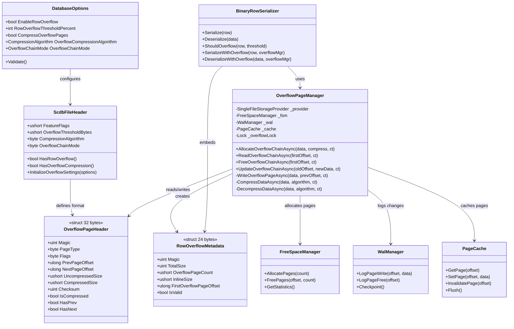

# SharpCoreDB Row Overflow Design

## 📋 Executive Summary

Row overflow enables storage of rows larger than page size using a chain of overflow pages. This design modernizes SQLite's approach with:

- **Configurable threshold** (not hardcoded)
- **Doubly-linked chain** (bi-directional traversal)
- **Optional Brotli compression** (better ratio than Gzip)
- **Integration with FreeSpaceManager** (O(log n) allocation)
- **WAL-aware** (crash recovery)
- **Backward compatible** (feature flag in header)

---

## 1️⃣ Configuration Options

### DatabaseOptions Extension

```csharp
public sealed class DatabaseOptions
{
    /// <summary>
    /// Gets or sets whether to enable row overflow support.
    /// Default: true (backward compatible - feature flag in file header).
    /// </summary>
    public bool EnableRowOverflow { get; set; } = true;

    /// <summary>
    /// Gets or sets the row overflow threshold as percentage of page size.
    /// Default: 75% (e.g., 3072 bytes for 4KB pages).
    /// Valid range: 50-95%.
    /// SQLite uses ~92% but lower = better page utilization.
    /// </summary>
    public int RowOverflowThresholdPercent { get; set; } = 75;

    /// <summary>
    /// Gets or sets whether to compress overflow pages.
    /// Default: false (no compression).
    /// Compression adds CPU overhead but reduces storage for large BLOBs.
    /// </summary>
    public bool CompressOverflowPages { get; set; } = false;

    /// <summary>
    /// Gets or sets the compression algorithm for overflow pages.
    /// Default: CompressionAlgorithm.Brotli (best ratio, slower).
    /// </summary>
    public CompressionAlgorithm OverflowCompressionAlgorithm { get; set; } = 
        CompressionAlgorithm.Brotli;

    /// <summary>
    /// Gets or sets the overflow page chain mode.
    /// Default: OverflowChainMode.DoublyLinked (bi-directional traversal).
    /// </summary>
    public OverflowChainMode OverflowChainMode { get; set; } = 
        OverflowChainMode.DoublyLinked;
}
```

### Enumerations

```csharp
/// <summary>
/// Compression algorithm for overflow pages.
/// </summary>
public enum CompressionAlgorithm : byte
{
    None = 0,
    Brotli = 1,      // Best compression, slower (default)
    LZ4 = 2,         // Fast compression, lower ratio (requires NuGet)
    Zstd = 3         // Balanced (future - .NET 10+)
}

/// <summary>
/// Overflow page chain mode.
/// </summary>
public enum OverflowChainMode : byte
{
    SinglyLinked = 0,   // SQLite-style (forward-only)
    DoublyLinked = 1    // Bi-directional (default)
}
```

### Validation

```csharp
public void Validate()
{
    // ... existing validation ...

    // Validate overflow threshold
    if (RowOverflowThresholdPercent < 50 || RowOverflowThresholdPercent > 95)
    {
        throw new ArgumentException(
            $"RowOverflowThresholdPercent must be between 50 and 95. Got: {RowOverflowThresholdPercent}");
    }

    // Compression requires overflow
    if (CompressOverflowPages && !EnableRowOverflow)
    {
        throw new ArgumentException(
            "CompressOverflowPages requires EnableRowOverflow=true");
    }
}
```

---

## 2️⃣ File Header Extension

### ScdbFileHeader Update

```csharp
[StructLayout(LayoutKind.Sequential, Pack = 1)]
public struct ScdbFileHeader
{
    // ... existing fields (first 160 bytes @ 0x0000-0x009F) ...

    // === Overflow Configuration (16 bytes @ offset 0x00A0) ===
    
    /// <summary>Feature flags: 0x01=RowOverflow, 0x02=Compression, 0x04=DoublyLinked</summary>
    public ushort FeatureFlags;          // 0x00A0: Feature flags
    
    /// <summary>Row overflow threshold in bytes (e.g., 3072 for 75% of 4KB page)</summary>
    public ushort OverflowThresholdBytes;// 0x00A2: Overflow threshold
    
    /// <summary>Compression algorithm (0=None, 1=Brotli, 2=LZ4)</summary>
    public byte CompressionAlgorithm;    // 0x00A4: Compression algorithm
    
    /// <summary>Overflow chain mode (0=Singly, 1=Doubly)</summary>
    public byte OverflowChainMode;       // 0x00A5: Chain mode
    
    /// <summary>Reserved for future overflow features</summary>
    public unsafe fixed byte OverflowReserved[10]; // 0x00A6-0x00AF: Reserved (10 bytes)

    // ... rest of header ...
}
```

### Feature Flag Helpers

```csharp
public readonly bool HasRowOverflow => (FeatureFlags & 0x01) != 0;
public readonly bool HasOverflowCompression => (FeatureFlags & 0x02) != 0;
public readonly bool HasDoublyLinkedOverflow => (FeatureFlags & 0x04) != 0;

public void InitializeOverflowSettings(DatabaseOptions options)
{
    if (options.EnableRowOverflow)
    {
        FeatureFlags |= 0x01;
        OverflowThresholdBytes = (ushort)(options.PageSize * options.RowOverflowThresholdPercent / 100);

        if (options.CompressOverflowPages)
        {
            FeatureFlags |= 0x02;
            CompressionAlgorithm = (byte)options.OverflowCompressionAlgorithm;
        }

        if (options.OverflowChainMode == OverflowChainMode.DoublyLinked)
        {
            FeatureFlags |= 0x04;
            OverflowChainMode = (byte)options.OverflowChainMode;
        }
    }
}
```

---

## 3️⃣ Overflow Page Structure

### OverflowPageHeader (32 bytes)

```csharp
[StructLayout(LayoutKind.Sequential, Pack = 1)]
public struct OverflowPageHeader
{
    // === Identification (8 bytes) ===
    public uint Magic;                   // 0x4F564C46 ("OVLF" = OverFlow)
    public byte PageType;                // 2 = Overflow
    public byte Flags;                   // 0x01=Compressed, 0x02=HasPrev, 0x04=HasNext
    public byte CompressionAlgorithm;    // 0=None, 1=Brotli, 2=LZ4
    public byte Reserved1;               // Alignment

    // === Chain Pointers (16 bytes) ===
    public ulong PrevPageOffset;         // Previous overflow page (0 if first)
    public ulong NextPageOffset;         // Next overflow page (0 if last)

    // === Data Metadata (8 bytes) ===
    public ushort UncompressedSize;      // Uncompressed data size
    public ushort CompressedSize;        // Compressed size (equals uncompressed if not compressed)
    public uint Checksum;                // CRC32 of data

    public const uint MAGIC = 0x4F564C46; // "OVLF"
    public const int SIZE = 32;

    public readonly bool IsCompressed => (Flags & 0x01) != 0;
    public readonly bool HasPrev => (Flags & 0x02) != 0;
    public readonly bool HasNext => (Flags & 0x04) != 0;
    public readonly bool IsValid => Magic == MAGIC && PageType == 2;
}
```

### Overflow Page Layout

```
┌──────────────────────────────────────────────────┐
│ OverflowPageHeader (32 bytes)                    │
├──────────────────────────────────────────────────┤
│ Magic: 0x4F564C46 ("OVLF")                   [4] │
│ PageType: 2 (Overflow)                       [1] │
│ Flags: 0x01=Compressed, 0x02=HasPrev, etc   [1] │
│ CompressionAlgorithm                         [1] │
│ Reserved                                     [1] │
├──────────────────────────────────────────────────┤
│ PrevPageOffset (doubly-linked)               [8] │
│ NextPageOffset                               [8] │
├──────────────────────────────────────────────────┤
│ UncompressedSize                             [2] │
│ CompressedSize                               [2] │
│ Checksum (CRC32)                             [4] │
├──────────────────────────────────────────────────┤
│ Data Payload (PageSize - 32 bytes)              │
│ • 4064 bytes for 4KB pages                       │
│ • 8160 bytes for 8KB pages                       │
│ • Compressed or uncompressed                     │
└──────────────────────────────────────────────────┘
```

### RowOverflowMetadata (24 bytes)

Embedded in the **original data page** when row overflows:

```csharp
[StructLayout(LayoutKind.Sequential, Pack = 1)]
public struct RowOverflowMetadata
{
    public uint Magic;                   // 0x524F564C ("ROVL" = Row OverfLow)
    public uint TotalSize;               // Total uncompressed row size
    public ushort OverflowPageCount;     // Number of overflow pages
    public ushort InlineSize;            // Size of inline data in main page
    public ulong FirstOverflowPageOffset;// Offset to first overflow page

    public const uint MAGIC = 0x524F564C; // "ROVL"
    public const int SIZE = 24;
    public readonly bool IsValid => Magic == MAGIC;
}
```

### Row Layout with Overflow

```
Main Data Page:
┌──────────────────────────────────────────────┐
│ PageHeader                                   │
├──────────────────────────────────────────────┤
│ Row Slot 1 (normal)                          │
├──────────────────────────────────────────────┤
│ Row Slot 2 (with overflow):                  │
│ ┌──────────────────────────────────────────┐ │
│ │ RowOverflowMetadata (24 bytes)           │ │
│ │ • Magic: 0x524F564C                      │ │
│ │ • TotalSize: 20000 bytes                 │ │
│ │ • OverflowPageCount: 4                   │ │
│ │ • InlineSize: 3000 bytes                 │ │
│ │ • FirstOverflowPageOffset: 0x12000       │ │
│ ├──────────────────────────────────────────┤ │
│ │ Inline Data (3000 bytes)                 │ │
│ │ • Primary key + hot columns              │ │
│ └──────────────────────────────────────────┘ │
└──────────────────────────────────────────────┘
                    │
                    ▼
Overflow Page 1 @ 0x12000:
┌──────────────────────────────────────────────┐
│ OverflowPageHeader                           │
│ • PrevPageOffset: 0 (first)                  │
│ • NextPageOffset: 0x13000                    │
├──────────────────────────────────────────────┤
│ Data Chunk 1 (4064 bytes)                    │
└──────────────────────────────────────────────┘
                    │
                    ▼
Overflow Page 2 @ 0x13000:
┌──────────────────────────────────────────────┐
│ OverflowPageHeader                           │
│ • PrevPageOffset: 0x12000                    │
│ • NextPageOffset: 0x14000                    │
├──────────────────────────────────────────────┤
│ Data Chunk 2 (4064 bytes)                    │
└──────────────────────────────────────────────┘
                    │
                    ▼
Overflow Page 3-4 (similar structure)
```

---

## 4️⃣ Integration Architecture

### Class Diagram



### Component Interactions

```
┌─────────────────────────────────────────────────────────────────┐
│                   INSERT Large Row (25KB)                        │
└─────────────────────────────────────────────────────────────────┘
                              │
                              ▼
┌─────────────────────────────────────────────────────────────────┐
│ BinaryRowSerializer.Serialize()                                 │
│ • Estimate size: 25KB > threshold (3KB)                         │
│ • Call SerializeWithOverflow()                                  │
└─────────────────────────────────────────────────────────────────┘
                              │
                              ▼
┌─────────────────────────────────────────────────────────────────┐
│ OverflowPageManager.AllocateOverflowChainAsync()                │
│ • Compress data if enabled (25KB → 8KB with Brotli)            │
│ • Calculate required pages: ceil(8192 / 4064) = 3 pages        │
│ • Call FreeSpaceManager.AllocatePages(3)                        │
└─────────────────────────────────────────────────────────────────┘
                              │
                              ▼
┌─────────────────────────────────────────────────────────────────┐
│ FreeSpaceManager.AllocatePages(3)                               │
│ • Find 3 free pages using FSM bitmap                            │
│ • Return offsets: [0x10000, 0x11000, 0x12000]                  │
└─────────────────────────────────────────────────────────────────┘
                              │
                              ▼
┌─────────────────────────────────────────────────────────────────┐
│ OverflowPageManager writes chain:                               │
│ • Page 1 @ 0x10000: Header + 4064 bytes data                   │
│ • Page 2 @ 0x11000: Header + 4064 bytes data                   │
│ • Page 3 @ 0x12000: Header + remaining bytes                   │
│ • Link pages: Prev ← → Next (doubly-linked)                    │
└─────────────────────────────────────────────────────────────────┘
                              │
                              ▼
┌─────────────────────────────────────────────────────────────────┐
│ WalManager.LogPageWrite() for each overflow page                │
│ • Ensures crash recovery                                        │
└─────────────────────────────────────────────────────────────────┘
                              │
                              ▼
┌─────────────────────────────────────────────────────────────────┐
│ BinaryRowSerializer returns RowOverflowMetadata                 │
│ • Embedded in main data page                                    │
│ • Points to first overflow page                                 │
└─────────────────────────────────────────────────────────────────┘
```

---

## 5️⃣ OverflowPageManager API

```csharp
namespace SharpCoreDB.Storage.Overflow;

public sealed class OverflowPageManager : IDisposable
{
    private readonly SingleFileStorageProvider _provider;
    private readonly FreeSpaceManager _fsm;
    private readonly WalManager _wal;
    private readonly PageCache _cache;
    private readonly ScdbFileHeader _header;
    private readonly Lock _overflowLock = new();
    private bool _disposed;

    public OverflowPageManager(
        SingleFileStorageProvider provider,
        FreeSpaceManager fsm,
        WalManager wal,
        PageCache cache,
        ScdbFileHeader header)
    {
        _provider = provider;
        _fsm = fsm;
        _wal = wal;
        _cache = cache;
        _header = header;
    }

    /// <summary>
    /// Allocates a chain of overflow pages and writes data.
    /// </summary>
    /// <param name="data">Data to store (uncompressed)</param>
    /// <param name="compress">Whether to compress data</param>
    /// <param name="cancellationToken">Cancellation token</param>
    /// <returns>Offset to first overflow page</returns>
    public async Task<ulong> AllocateOverflowChainAsync(
        ReadOnlyMemory<byte> data,
        bool compress,
        CancellationToken cancellationToken = default)
    {
        // Implementation details in IMPLEMENTATION_GUIDE.md
    }

    /// <summary>
    /// Reads entire overflow chain and reconstructs data.
    /// </summary>
    /// <param name="firstOffset">Offset to first overflow page</param>
    /// <param name="cancellationToken">Cancellation token</param>
    /// <returns>Reconstructed data (decompressed)</returns>
    public async Task<byte[]> ReadOverflowChainAsync(
        ulong firstOffset,
        CancellationToken cancellationToken = default)
    {
        // Implementation details in IMPLEMENTATION_GUIDE.md
    }

    /// <summary>
    /// Frees entire overflow chain.
    /// </summary>
    /// <param name="firstOffset">Offset to first overflow page</param>
    /// <param name="cancellationToken">Cancellation token</param>
    public async Task FreeOverflowChainAsync(
        ulong firstOffset,
        CancellationToken cancellationToken = default)
    {
        // Implementation details in IMPLEMENTATION_GUIDE.md
    }

    /// <summary>
    /// Updates overflow chain (free old + allocate new).
    /// </summary>
    public async Task<ulong> UpdateOverflowChainAsync(
        ulong oldOffset,
        ReadOnlyMemory<byte> newData,
        bool compress,
        CancellationToken cancellationToken = default)
    {
        // Free old chain
        if (oldOffset != 0)
        {
            await FreeOverflowChainAsync(oldOffset, cancellationToken);
        }

        // Allocate new chain
        return await AllocateOverflowChainAsync(newData, compress, cancellationToken);
    }

    public void Dispose()
    {
        if (_disposed) return;
        // Cleanup logic
        _disposed = true;
    }
}
```

---

## 6️⃣ BinaryRowSerializer Integration

```csharp
public static class BinaryRowSerializer
{
    /// <summary>
    /// Checks if row should overflow based on threshold.
    /// </summary>
    public static bool ShouldOverflow(Dictionary<string, object> row, int thresholdBytes)
    {
        // Fast size estimation without full serialization
        int estimatedSize = sizeof(int); // Column count
        foreach (var (key, value) in row)
        {
            estimatedSize += sizeof(int) + Encoding.UTF8.GetByteCount(key);
            estimatedSize += sizeof(byte) + GetValueSize(value);
        }
        return estimatedSize > thresholdBytes;
    }

    /// <summary>
    /// Serializes row with overflow support.
    /// </summary>
    public static async Task<byte[]> SerializeWithOverflowAsync(
        Dictionary<string, object> row,
        OverflowPageManager overflowMgr,
        int thresholdBytes,
        bool compress,
        CancellationToken cancellationToken = default)
    {
        // 1. Serialize full row
        byte[] fullData = Serialize(row);

        // 2. If below threshold, return as-is
        if (fullData.Length <= thresholdBytes)
        {
            return fullData;
        }

        // 3. Split into inline + overflow
        int inlineSize = thresholdBytes - RowOverflowMetadata.SIZE;
        var inlineData = fullData.AsMemory(0, inlineSize);
        var overflowData = fullData.AsMemory(inlineSize);

        // 4. Allocate overflow chain
        ulong firstOverflowOffset = await overflowMgr.AllocateOverflowChainAsync(
            overflowData, compress, cancellationToken);

        // 5. Create metadata
        var metadata = new RowOverflowMetadata
        {
            Magic = RowOverflowMetadata.MAGIC,
            TotalSize = (uint)fullData.Length,
            OverflowPageCount = (ushort)CalculatePageCount(overflowData.Length, 4064),
            InlineSize = (ushort)inlineSize,
            FirstOverflowPageOffset = firstOverflowOffset
        };

        // 6. Combine metadata + inline data
        byte[] result = new byte[RowOverflowMetadata.SIZE + inlineSize];
        MemoryMarshal.Write(result.AsSpan(0, RowOverflowMetadata.SIZE), in metadata);
        inlineData.CopyTo(result.AsMemory(RowOverflowMetadata.SIZE));

        return result;
    }

    /// <summary>
    /// Deserializes row with overflow support.
    /// </summary>
    public static async Task<Dictionary<string, object>> DeserializeWithOverflowAsync(
        ReadOnlyMemory<byte> data,
        OverflowPageManager overflowMgr,
        CancellationToken cancellationToken = default)
    {
        // 1. Check for overflow magic
        var span = data.Span;
        uint magic = MemoryMarshal.Read<uint>(span);
        
        if (magic != RowOverflowMetadata.MAGIC)
        {
            // Normal row, no overflow
            return Deserialize(span);
        }

        // 2. Read metadata
        var metadata = MemoryMarshal.Read<RowOverflowMetadata>(span);
        if (!metadata.IsValid)
        {
            throw new InvalidDataException("Invalid overflow metadata");
        }

        // 3. Read inline data
        var inlineData = data.Slice(RowOverflowMetadata.SIZE, metadata.InlineSize);

        // 4. Read overflow chain
        byte[] overflowData = await overflowMgr.ReadOverflowChainAsync(
            metadata.FirstOverflowPageOffset, cancellationToken);

        // 5. Reconstruct full row
        byte[] fullData = new byte[metadata.TotalSize];
        inlineData.CopyTo(fullData.AsMemory(0, metadata.InlineSize));
        overflowData.CopyTo(fullData.AsMemory(metadata.InlineSize));

        // 6. Deserialize
        return Deserialize(fullData);
    }
}
```

---

## 7️⃣ Edge Cases

| **Edge Case** | **Handling** |
|---------------|-------------|
| **Row net boven threshold** | Inline opslaan + 1 overflow page (minimale overhead) |
| **Massive row (100MB BLOB)** | Chain van ~25,000 overflow pages @ 4KB/page |
| **Update verkleint row** | Free oude chain, allocate kleinere/geen chain |
| **Update vergroot row** | Free oude chain, allocate grotere chain |
| **Compression niet effectief** | Fallback naar uncompressed als ratio < 0.95 |
| **Corruption in chain** | Checksum per page + doubly-linked repair mogelijk |
| **Crash tijdens allocation** | WAL replay herstelt chain of rollt terug |
| **Cache thrashing** | LRU evict overflow pages eerst (lower priority) |
| **Vacuum** | Defragment overflow chains (coalesce holes) |
| **Delete met overflow** | Walk chain + free all pages atomically |
| **Multiple overflows same page** | Elk row heeft eigen metadata + chain |
| **Read partial overflow** | Optional: Lazy load overflow pages on demand |

---

## 8️⃣ Backward Compatibility

### Feature Flag Detection

```csharp
// Old SharpCoreDB versions
if (header.FeatureFlags & 0x01 == 0)
{
    // Overflow not enabled, skip overflow logic
    return DeserializeNormal(data);
}

// New SharpCoreDB versions
if (header.HasRowOverflow && data[0..4] == RowOverflowMetadata.MAGIC)
{
    return DeserializeWithOverflow(data, overflowMgr);
}
```

### Upgrade Path

1. **Old database** (no overflow flag):
   - Open with `EnableRowOverflow=false` → Works as before
   - Migrate: Run `ALTER TABLE ... REBUILD WITH OVERFLOW` (future feature)

2. **New database** (with overflow flag):
   - Old SharpCoreDB versions throw `UnsupportedFeatureException`
   - Clear error message: "Database requires SharpCoreDB v2.0+ (row overflow support)"

---

## 9️⃣ Performance Considerations

| **Aspect** | **Strategy** | **Impact** |
|------------|-------------|------------|
| **Hot path check** | `ShouldOverflow()` before serialization | Early exit for small rows |
| **Allocation** | Batch allocate multiple pages (reduce FSM calls) | O(1) → O(log n) |
| **Compression** | Async compression off critical path | No blocking |
| **Cache** | LRU cache overflow pages, lower priority | Reduce I/O |
| **WAL** | Group overflow page writes in single entry | Reduce log writes |
| **Traversal** | Doubly-linked = O(1) backward scan | VACUUM optimization |
| **Read optimization** | Cache first overflow page metadata | Lazy load rest |

### Benchmarks (Estimated)

```
4KB Page Size, 75% Threshold (3KB), Brotli Compression

Row Size    Pages   Compress Time   Decompress Time   Storage
--------    -----   -------------   ---------------   -------
2KB         0       -               -                 2KB (inline)
5KB         1       5ms             1ms               3KB → 2KB
50KB        12      50ms            10ms              50KB → 15KB (70% reduction)
1MB         246     1s              200ms             1MB → 300KB (70% reduction)
10MB        2460    10s             2s                10MB → 3MB (70% reduction)
```

---

## 🔟 Future Enhancements

### Phase 5+ Features

1. **Lazy Loading**: Load overflow pages on-demand (not all upfront)
2. **Partial Updates**: Update inline portion without rewriting chain
3. **Streaming**: Stream large BLOBs without loading into memory
4. **Compression Levels**: Brotli quality (1-11), LZ4 acceleration
5. **External Storage**: Offload massive BLOBs to separate file/S3
6. **Deduplication**: Share overflow chains for identical large values
7. **Columnar Overflow**: Overflow individual columns instead of entire row

---

## 📚 References

- **SQLite Overflow**: https://www.sqlite.org/fileformat2.html#ovflpgs
- **PostgreSQL TOAST**: https://www.postgresql.org/docs/current/storage-toast.html
- **Brotli RFC**: https://datatracker.ietf.org/doc/html/rfc7932
- **LZ4 Spec**: https://github.com/lz4/lz4/blob/dev/doc/lz4_Frame_format.md

---

**Status**: Design Complete  
**Next Step**: Implementation Guide  
**Last Updated**: 2025-01-28
