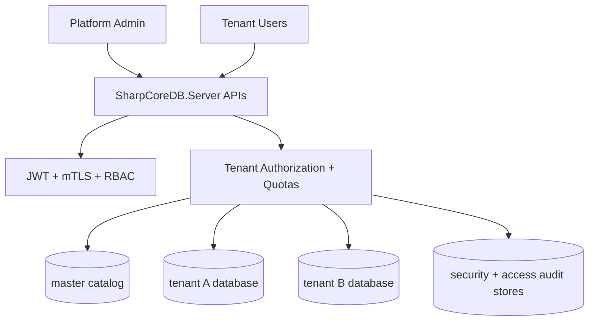

# SharpCoreDB Server Multi-Tenant SaaS Reference v1.7.0

## Overview
This guide describes the recommended production setup for SharpCoreDB Server multi-tenancy using a **database-per-tenant** model.

## Recommended Pattern
- `master` hosts the tenant catalog, quotas, lifecycle events, and security metadata.
- each tenant receives a dedicated database file
- JWT/database-scope claims and tenant-aware authorization enforce tenant isolation
- per-tenant quotas, encryption keys, and security audit events are enabled

## Reference Flow
1. platform admin authenticates
2. tenant is provisioned through `POST /api/v1/tenants`
3. tenant database mapping is registered in the catalog
4. tenant-scoped users obtain JWT tokens
5. requests are checked for tenant claims, grants, quotas, and audit emission

## Architecture Diagram

## Sample Assets
See `Examples/Server/SharpCoreDB.MultiTenantSaaSSample/` for:
- sample configuration
- PowerShell isolation validation script
- REST onboarding flow

## Migration Path
### Single-tenant to multi-tenant
1. move shared metadata into `master`
2. create a dedicated database per tenant
3. configure tenant-scoped users and JWT claims
4. enable quotas and tenant security audit endpoints
5. run isolation validation before production cutover

### Shared-database optional mode
Shared-database mode remains optional and should only be used when operational simplicity outweighs isolation requirements. Prefer database-per-tenant unless there is a clear reason not to.

## Validation Checklist
- tenant provisioning succeeds
- same-tenant requests succeed
- cross-tenant requests are denied
- quota denials are observable
- security audit endpoints show login/connect/access-denied events
