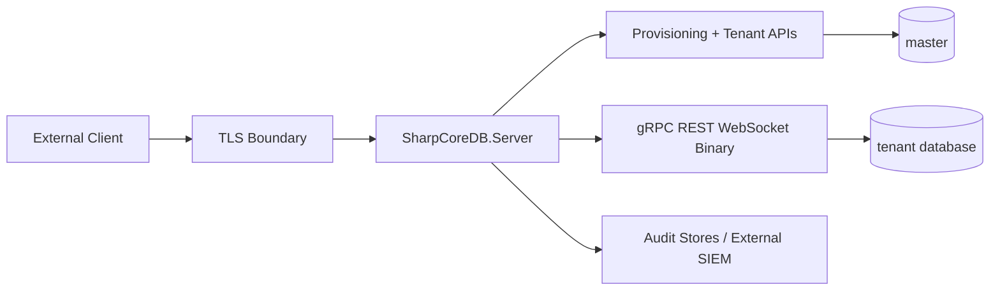

# SharpCoreDB Server Multi-Tenant Threat Model v1.6.0

## Goal
Document primary cross-tenant security risks and the mitigations implemented in SharpCoreDB Server.

## Trust Boundaries

## Key Threats and Mitigations
| Threat | Risk | Mitigation |
|---|---|---|
| JWT token replay across tenants | Cross-tenant access | Tenant/database-scoped claims, tenant-aware authorization checks, audit trails |
| Mis-scoped grants | Unauthorized data access | Database grant model, explicit grant change auditing |
| Noisy neighbor overload | Tenant impact on others | Per-tenant quotas for sessions, QPS, storage, and batch size |
| Key reference mismatch | Data exposure or outage | Tenant key provider abstraction, rotation flow with safety checks |
| Control-plane abuse | Unauthorized provisioning or quota changes | Admin-protected tenant APIs, security audit events |
| Missing forensic trail | Weak incident response | Access audit + security audit events + sink integration |
| Cross-protocol bypass | Inconsistent enforcement | gRPC, REST, binary, and WebSocket enforcement aligned on shared services |

## Assumptions
- TLS 1.2+ is enforced
- operators manage secrets outside source control
- production environments export security audits to durable storage

## Residual Risks
- in-memory audit retention alone is not sufficient for compliance retention windows
- sample configuration secrets must be replaced before deployment
- shared-database mode has a wider blast radius than database-per-tenant mode

## Recommended Production Controls
- use unique per-tenant key references
- keep database-per-tenant as the default topology
- enable external audit sinks
- rotate JWT secrets and tenant credentials regularly
- run tenant isolation validation after provisioning and after material configuration changes
